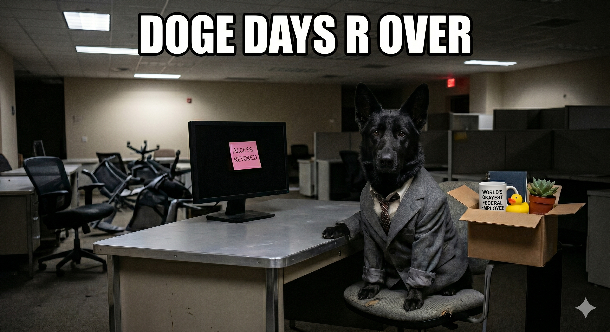

# 🐕 DOGE_Days_R_Over

> *"Such workforce. Many cuts. Wow."*

## Overview

The DOGE Days R Over — because the only thing getting reduced in force around here is our patience. This repository contains the full research pipeline for analyzing public sentiment on Reddit regarding the **Department of Government Efficiency (DOGE)**'s federal workforce reductions (aka the Reduction in Force, or RIF).

We scraped Reddit so you don't have to. We ran the models so you can judge us. We hand-coded 400 comments so our grad student wrists will never fully recover.

## 📂 Repository Structure

| File                        | Description                                  |
|-----------------------|-------------------------------------------------|
| `Reddit_API.qmd`            | Reddit API data collection pipeline          |
| `Reddit_eda.qmd`            | Exploratory data analysis                    |
| `Reddit_sentiment.qmd`      | Sentiment analysis                           |
| `reddit_doge_paper.qmd`     | Paper 1: EDA & hand-coded sentiment          |
| `llm_reddit_doge_paper.qmd` | Paper 2: ML & LLM stance classification      |
| `llama_llm_code.R`          | LLaMA zero-shot classification via `rollama` |
| `bibliography.bib`          | References                                   |

\## 📊 What We Did

-   **Scraped** 557 unique Reddit posts and 12,553 comments across 19 subreddits (March 2–10, 2025)
-   **Analyzed** post/comment volume spikes around major DOGE news events
-   **Hand-coded** 400 comments for stance: 54% opposed, 28% in favor, 18% neutral
-   **Classified** using 13 supervised ML models (Random Forest, XGBoost, KNN, and friends)
-   **Deployed** two LLMs for zero-shot stance classification: LLaMA 3.2B and Gemma 3.12B

## 🔑 Key Findings

-   Reddit was **not happy**: 217 of 400 coded comments opposed DOGE's approach
-   Post volume **spiked** around high-profile news events (very news, much react)
-   Top words: *people, government, federal, employees, cuts* — basically a federal HR nightmare in word cloud form
-   Supervised models and LLMs both struggled with "favor" and "neutral" stances but could reliably detect opposition
-   Gemma and LLaMA agreed on "oppose" (κ = .80) but basically flipped coins on everything else (κ = .03 for neutral 😬)

## 🛠️ Tech Stack

-   **R** — data collection, EDA, visualization (`tidyverse`, `tidytext`, `ggplot2`, `rollama`)
-   **Python** — ML classification (`scikit-learn`, `XGBoost`)
-   **Quarto** — reproducible documents
-   **LLMs** — LLaMA 3.2B (local GPU), Gemma 3.12B (HPC cluster)

## 📄 Papers

1.  *DOGE Days on Reddit: Decoding Public Sentiment in a Federal Shakeup* → `reddit_doge_paper.pdf`
2.  *DOGE's Downsizing, Can AI Read the Reddit Room?* → `llm_reddit_doge_paper.pdf`

## 👥 Authors

-   **Kevin Linares** — University of Maryland
-   **Felix Baez-Santiago**
    -   **Aria Lu**
    -   **Gloria Zhou** — University of Michigan

------------------------------------------------------------------------

*This repository is not affiliated with DOGE, the federal government, Elon Musk, or actual Dogecoin. Much research. Very reproducible. Wow.*
